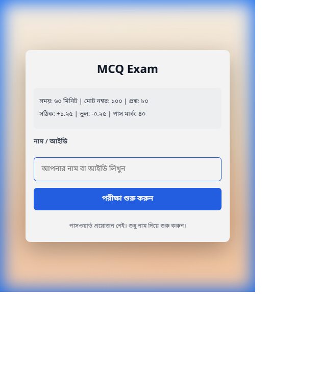
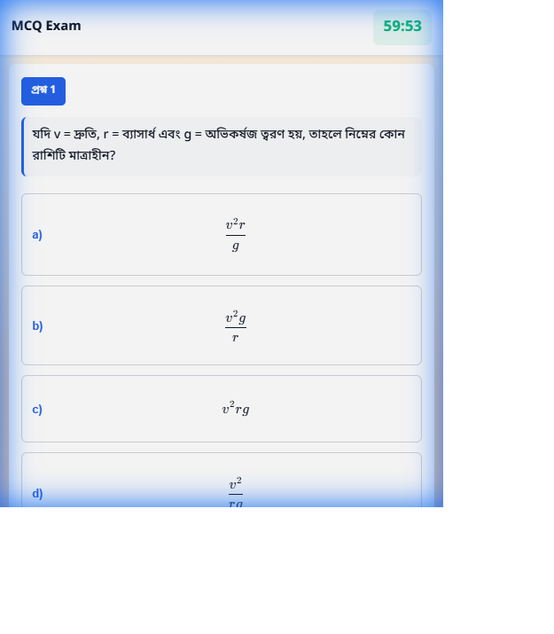
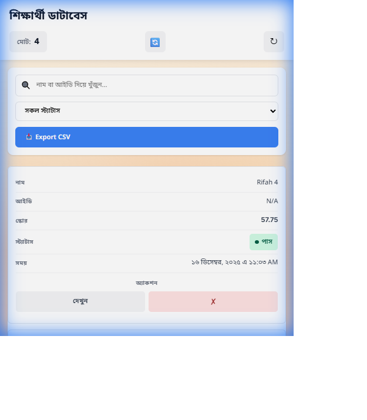

# 80 MCQ Exam System

Single-page MCQ exam (student) + admin dashboard. Questions/answers stored in GitHub JSON; submissions appended via Vercel serverless API.
Now supports 80 questions!

**Live Demo:** [https://80-mcq.vercel.app/](https://80-mcq.vercel.app/)

## Screenshots

### Exam Start Page

*Students enter their name to begin the exam*

### Question Interface

*MCQ interface with timer, question display, and answer options*

### Admin Panel

*Admin dashboard showing student submissions, scores, and status*

## Features
- Student starts exam with name/ID (no password)
- 60 min timer, 80 MCQ
- Scoring: +1.25 correct, -0.25 wrong, 0 unanswered; Pass ≥ 60.0
- LocalStorage autosave during exam
- Submit saves to GitHub `answers.json`
- Admin page lists scores, pass/fail, timestamp, and detailed answers

## Files
- `index.html` / `exam.js` / `styles.css` — student exam UI
- `admin.html` / `admin.js` — admin dashboard
- `questions.json` — 80 questions in Bengali (Physics, Chemistry, Math)
- `answers.json` — submissions store (appended by API)
- `api/save-answer.js` — Vercel function writing to GitHub

## Run locally
```bash
npm install # only if you add tooling; static files otherwise
npm run dev # if using a dev server; else open index.html
```
Use any static server, e.g. `npx serve .`

## Deploy to Vercel
1) Push this repo to GitHub.  
2) Create a Vercel project pointing to the repo.  
3) Set Environment Variables in Vercel Project Settings:
```
GITHUB_OWNER=<your-github-username-or-org>
GITHUB_REPO=<repo-name>
GITHUB_BRANCH=main          # optional, defaults to main
GITHUB_TOKEN=<PAT with repo scope>
```
4) Deploy. Student page: `/`. Admin page: `/admin.html`.

## GitHub JSON notes
- `questions.json`: contains 50 questions in Bengali covering multiple science topics.
- `answers.json`: should start as `[]`. API appends each submission.

## API details
- Endpoint: `/api/save-answer` (POST JSON)
- Body example:
```json
{
  "studentName": "Alice",
  "answers": { "1": "A", "2": "C" },
  "score": 72.5,
  "totalMarks": 100,
  "timestamp": "2025-01-01T12:00:00.000Z",
  "attempted": 60,
  "correct": 55,
  "wrong": 5,
  "pass": true
}
```

## Admin page data source
- Currently reads `answers.json` from the same repo path. If hosting elsewhere, set the URL in `admin.js` (`RESULTS_URL`).

## Customization
- Update branding/texts in `index.html` and `admin.html`.
- Styling in `styles.css`.
- Adjust scoring/timer in `src/components/MCQContainer.jsx` (`MARK_PER_QUESTION`, `NEGATIVE_MARKING`, `DURATION_SECONDS`, `PASS_MARK`).

## Known limitations
- No authentication; admin page is open via URL.
- GitHub write is append-only; no concurrency lock. For heavy traffic, consider a DB.

